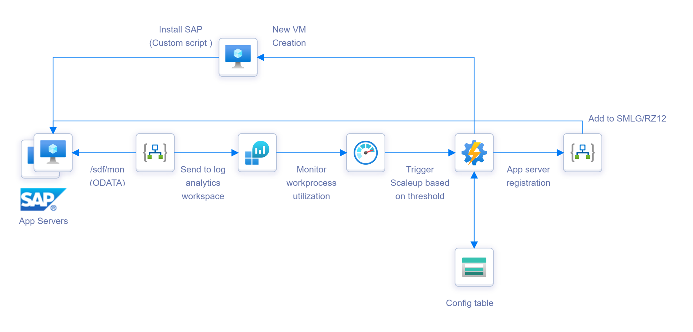
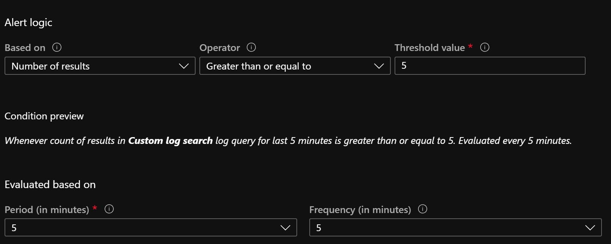

# Auto scaling of SAP app servers in Azure
This terraform template sets up components required to achieve auto scaling of SAP application servers in Azure based on SAP performance metrics. 

[Solution Overview](#solution-overview)

[Setup Instructions](#setup-instructions)


# Solution Overview 

## SAP Application Server Scale out Architecture



SAP work process utilization data is collected from /sdf/mon table using logic app and dumped to log analytics workspace. Azure monitor is then used to query the table and alert based on set thresholds. The alert triggers an automation runbook which creates new app servers using ARM templates and uses logic app to add the new SAP application server to logon groups. All config related to scaling is maintained in a table (called scalingconfig) within storage account. This includes properties of the new VM to be created, logon/server groups to be added to, max/min count for application servers etc. 

## SAP Application Server Scale down Architecture


Scaledown is achieved by means of 2 automation runbooks.  The first runbook removes the application servers from the logon/server groups using logic app and schedules the second runbook based on a delay configurable using the scalingconfig table. This helps in existing user sessions to be drained out of SAP application server to be removed. The second runbook does a soft shutdown of the application server (shutdown timeout can also be configured using the config table) and then deletes the application servers.  Trigger for the scale down would depend on customer scenarios. It can be configured using one of the following methods

 - Schedule based - Schedule scale down runbook to be executed at the end of business day everyday. 
 - Utilization based
 - Alert status

##  :bulb: Solution Highlights

- Modular – Auto scaling solution can be plugged into customer’s existing monitoring and alerting infrastructure (including solution manager) by using webhooks to trigger the automation runbook.

- Runbooks can be used to schedule scaling for seasonal elasticity (month-end, peak trading period etc.). Increment size for scaling is configurable (i.e. add 'n' app servers for month-end)

- Configurable – Parameters for scaling can be customized per SID as required.

- Work process utilization dashboards (with longer retention) can be created from the custom logs table in log analytics workspace. 

# Setup Instructions

## Pre-requisites

- On-prem data gateway for logic app SAP connector to connect to SAP system using RFC. See here [https://docs.microsoft.com/en-us/azure/logic-apps/logic-apps-gateway-connection] https://docs.microsoft.com/en-us/azure/logic-apps/logic-apps-gateway-connection for details on how to set this up.
- ODATA service url on the SAP system for accessing data from /sdf/mon table. Please see sample instructions here for creating the ODATA service.
- Custom VM image id for the new app servers to be added.  Scripts in this repo uses custom VM images for building new application servers. Create a custom VM image of an existing application server VM by running ``sudo waaagent -deprovision`` (use without the user option to preseve sidadm user) as shown here[https://docs.microsoft.com/en-us/azure/virtual-machines/linux/capture-image] https://docs.microsoft.com/en-us/azure/virtual-machines/linux/capture-image .  Once the image is created note down the image id.  For ongoing image maintenance save the image in **Shared Image Gallery** and use **Azure Image Builder** to keep the image upto date.  If you want to use standard marketplace images, customize the ARM template and shell script appserver_setup.sh accordingly.

## Installation

-  Clone this github repo and populate terraform.tfvars. Sample file with parameters is provided.
-  Run ``terraform init`` followed by ``terraform apply`` to deploy the required resources. The template deploys 2 logic app instances (one for data collection and other for logon group registration), 3 automation runbooks, log analytics workspace, Azure table storage for configuration and a blob container which has the scripts/ARM templates required.
-  Once the deployment is completed login to Azure portal and check the API connections within logic app used for logon group registration. Check that SAP connection doesnt show any connectivity issues. For office-365 connection you need to authorize it by entering your credentials. 
-  Create a RunAsAccount within the Automation account created. The RunAsAccount will be used for authentication for managing the resources. 

## Post Steps

- Enable the data collection logic app. Check that the performance data is getting populated in Log analytics workspace. Custom log table will be created in log analytics workspace with naming convention SAPPerfmonSID_CL.
- Create an action group to trigger SAPScaleOut runbook with required configuration. 
- Create an alert based on custom log query to alert on work process utilization.  Sample query is shown below. This query is used to trigger an alert when either number of free work process is less than 1 or active dialog work process is greater than 8 or number of user sessions is greater than 50 in an application server. 

```customquery
SAPPerfmonTST_CL 
| where No__of_free_RFC_WPs_d <= 1 or Active_Dia_WPs_d  >= 8 or Users_d > 50
| summarize count() by Servername_s
| where count_ >= 5
```
- Customize the count value, alert logic, period and frequency based on the requirement. See sample settings below 
