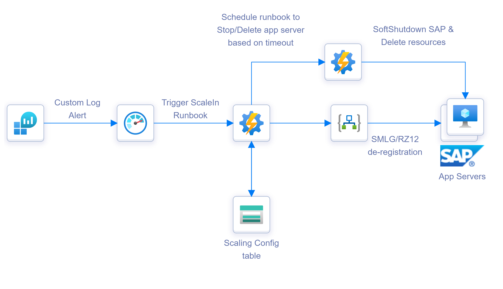

# Auto Scaling Solution
This repository provides an approach and sample code for auto scaling SAP application servers in Azure based on SAP performance metrics.  The solution is split into 2 parts

[SAP Telemetry Collection](#sap-telemetry-collection)

[SAP AutoScaling Solution](#sap-autoscaling-solution)

## SAP telemetry collection

SAP telemetry collection architecture is as shown below. Here we ingest the SAP performance metrics data from /SDF/MON_HEADER (or /SDF/SMON_HEADER depending on what is scheduled) using Logic App into a custom log table in log analytics workspace. 

## SAP AutoScaling Solution

### SAP Application Server Scale Out Architecture 

- Using Azure Monitor create a log alert which queries the Custom log table with the SAP performance data and creates an alert when specific threshold is breached. 
- The alert triggers a Azure Automation Powershell runbook. The runbook checks the Scaling Config table to see if current app server count is equal to max. app server count. If yes it exits without performing any action. 
- If not it triggers an ARM template to create a new application server based on Custom VM Image (of a pre-built app server).
- After successful creation of app server, the runbook calls Logic app to regiser new application server in SAP Logon and Server groups. Groups information are fetched from Config table.
- Finally the PS runbook updates the Current app server count in the Scaling Config table.

### SAP Application Server Scale in Architecture

- Using Azure Monitor create a log alert which queries the Custom log table with the SAP performance data and creates an alert when specific threshold is breached. 
- The alert triggers a Azure Automation Powershell runbook. The runbook checks the Scaling Config table to see if current app server count is equal to min. app server. If yes it exits without performing any action. 
- If not the runbook calls Logic app to to de-register the application servers from Logon and Server groups. Group information is fetched from the Config table.
- The runbook then schedules a second runbook based on Delay timeout defined in the config table. This allows exising user sessions/jobs to be drained from the application server before its Stopped. 
- The second runbook issues a SoftShutdown Command on the application server with a timeout fetched from config table.   
- Once the SAP application server is successfully stopped, the corresponding Azure resources (VM, NIC and disks) are deleted from within the runbook. 
- Finally the PS runbook updates the Current app server count in the Scaling Config table.
