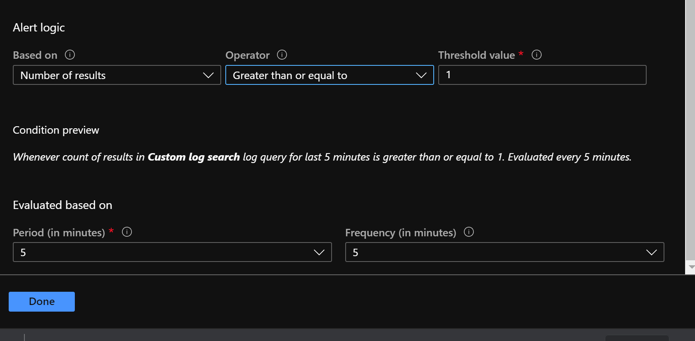

# Auto scaling of SAP app servers in Azure

This folder contains Terraform template to deploy SAP autoscaling solution. The template deploys a logic app instance (for logon group registration), 3 automation runbooks, Azure table storage for configuration and a blob container which has the scripts/ARM templates required.

## Scaling Configuration Table

All properties required for scaling are maintained in a config table within a storage account in Azure and are configurable per SID.  The details of the config are explained 

| Configuration | How it is used |
| --- | --- |
| CurrentAppCount | Used to track the current app server count. Updated by runbooks when app servers are added or deleted |
| MaxAppCount | Max. number of app servers for scale out. If CurrentAppCount equals MaxAppCount no further app servers will be added. |
| MinAppCount | Min. number of app servers for scale in. If CurrentAppCount equals MinAppCount no further app servers will be removed/deleted. |
| SAPAppLoadBalancer | Azure load balancer to which new app servers need to be added to |
| SAPAppNamingPrefix | Prefix to be used for names of new app server. For example if prefix is tst-app-vm- and current app server count is 2, new app server wil be created with name tst-app-vm-3 |
| SAPAppVmSize | Size of the new app server VM to be created |
| SAPCustomImageId | Custom VM image to be used for new app server creation |
| SAPDeleteTimeout | Time delay in minutes between removing app servers from logon groups to stopping/deleting them. Min value is 10 |
| SAPShutdownTImeout | Timeout value in seconds to be used for SAP softshutdown |
| SAPImageHostName | SAP app server hostname from which custom VM image was created. SAP profiles/home directories are created by search and replace of this hostname with new hostname. Refer appserver_setup.sh for details |
| SAPInstanceNr | Instance number of SAP appserver to be created. Needs to be the same as the appserver used to create the image |
| SAPLogonGroups | SMLG logon groups the new appservers should be added to. Multiple values can be entered comma separated |
| SAPServerGroups | RZ12 Server groups the new appservers should be added to. Multiple values can be entered comma separated |
| SAPAvSet | Availability set of the SAP application servers. Newly created app servers will be added to this AvSet |
| SAPRegion | Azure region for creating the new appservers |
| SAPVnet | Azure VNET for creating new appservers |
| SAPSubnet |  Azure Subnet for creating the new appservers |
 

## Pre-requisites

- On-prem data gateway for logic app SAP connector to connect to SAP system using RFC should be installed. See here https://docs.microsoft.com/en-us/azure/logic-apps/logic-apps-gateway-connection for details on how to set this up. The VM where On-prem data gateway is running also needs to have the SAP .Net Connector installed. See here https://docs.microsoft.com/en-us/azure/logic-apps/logic-apps-using-sap-connector
- Custom VM image id for the new app servers to be added.  Scripts in this repo uses custom VM images for building new application servers. Create a custom VM image of an existing application server VM by running ``sudo waaagent -deprovision`` (use without the user option to preserve sidadm user) as shown here https://docs.microsoft.com/en-us/azure/virtual-machines/linux/capture-image .  Once the image is created note down the image id.  For ongoing image maintenance save the image in **Shared Image Gallery** and use **Azure Image Builder** to keep the image upto date.  If you want to use standard marketplace images, customize the ARM template and shell script appserver_setup.sh accordingly.
- DNS updates needs to be taken care for the newly created VMs. You could either have the DNS records pre-created for the new set of application servers or use dynamic updates. With Azure DNS you have the option of autoregisration. See below link for details.

https://docs.microsoft.com/en-us/azure/dns/private-dns-autoregistration

https://docs.microsoft.com/en-us/azure/virtual-network/virtual-networks-name-resolution-ddns


## Installation

-  Clone this github repo. Navigate to autoscalingsolution folder and populate terraform.tfvars. Sample file with parameters is provided.
-  Run ``terraform init`` followed by ``terraform apply`` to deploy the required resources. 
-  Once the deployment is completed login to Azure portal and check if the all resurces are deployed. 
- Verify the API connections within logic app. Check that SAP connection doesnt show any connectivity issues. For office-365 connection you need to authorize it by entering your credentials. 
-  Create a RunAsAccount within the Automation account. The RunAsAccount will be used for authentication for managing the resources. 
-  Use Azure storage explorer to change the data type for following fields of scalingconfig table to int32 from string. Due to an issue with Terraform provider these get created as string by default.
 
 | PropertyName | Type |
 | --- | ---
 | CurrentAppCount | Int32 |
 | MaxAppCount | Int32 |
 | MinAppCount | Int32 |
 | SAPDeleteTimeout | Int32 |
 | SAPShutdownTimeout | Int32 |

## Post Steps

- Create 2 separate action groups in Azure monitor to trigger the ScaleOut and ScaleIn runbooks with required parameters. 
- Create an SAP Scale Out alert in Azure monitor based on custom log query to alert on work process utilization and link to the ScaleOut action group created above.  Sample query is shown below. This query is used to trigger an alert when either number of free work process is less than 1 or active dialog work process is greater than 8 or number of user sessions is greater than 50 in an application server. 

```customquery
SAPPerfmonTST_CL 
| where No__of_free_RFC_WPs_d <= 1 or Active_Dia_WPs_d  >= 8 or Users_d > 50
| summarize count() by Servername_s
| where count_ >= 5
```
- Customize the count value, alert logic, period and frequency based on the requirement. See sample settings below 


- For Scaling In based on utilization create an alert in Azure monitor based on work process utilization data and link to the Scale In Action group created in previous step. Sample query for Scaling in

```customquery
SAPPerfmonTST_CL 
| where No__of_free_RFC_WPs_d >= 7 and Active_Dia_WPs_d  <= 2 and Users_d < 50
| summarize count() by Servername_s
| where count_ >= 30
```
- Customize the count value, alert logic, period and frequency based on the requirement. Use Supress alert feature to reduce the number of times the alert gets generated. Inorder to avoid flapping (continuous scale-in and scale-out) set the threshold to a higher value for scale in (compared to scale out) so that the action will be triggered only if the utilization is low for a longer period. 