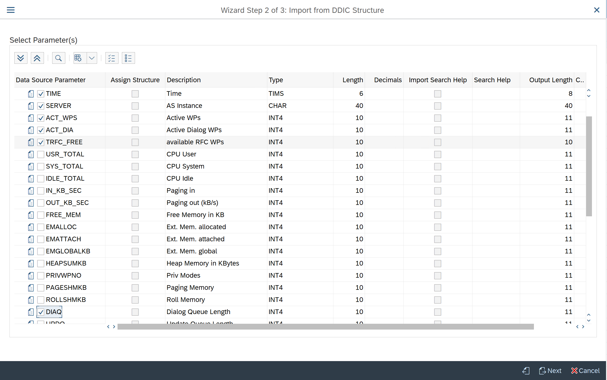
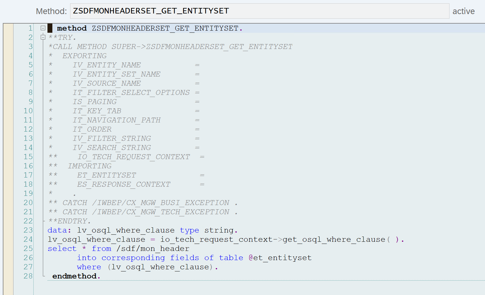

## SAP ODATA service creation for /SDF/MON mertics

- Go to transaction SEGW in the backend system. Create a gateway service.


- Right Click data model and choose Import from DDIC structure. Use /sdf/mon_header or /sdf/smon_header depending on the scenario.


- Choose the parameters which you want consume with this gateway service



- Choose columns for Primary key and Finish


- Save and generate the service using the Generate Runtime Objects option at the top

- Redefine the GET_ENTTITYSET method with the below code. Replace the table name with **/sdf/smon_header** if SMON is being used. We are not going to use the other methods in this demo so we will leave them empty. Save and activate the objects

``` abapcode
data: lv_osql_where_clause type string.
lv_osql_where_clause = io_tech_request_context->get_osql_where_clause( ).
select * from /sdf/mon_header
      into corresponding fields of table @et_entityset
      where (lv_osql_where_clause).
```


- Register and activate the service using transaction /IWFND/MAINT_SERVICE in gateway system.
- Check using the gateway client that you are able to query the service based on filter crtieria. See below for example


